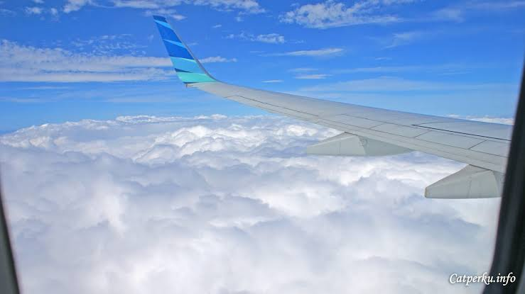

# ✈️ AeroSpot - Plane Spotting Logbook & Gallery

<div align="center">

<!-- Badge Bahasa Pemrograman & Teknologi Utama -->


<p>A modern, sleek, and elegant web-based application designed for aviation enthusiasts and plane spotters to log, manage, and showcase their best aircraft captures.</p>

<!-- Media Sosial & Kontak -->
<p>
  <a href="https://instagram.com/username_kamu" target="_blank"></a>
  <a href="https://tiktok.com/@username_kamu" target="_blank"></a>
  <a href="https://youtube.com/@username_kamu" target="_blank"></a>
  <a href="https://discord.gg/invite_kamu" target="_blank"></a>
  <a href="mailto:emailkamu@gmail.com"></a>
</p>

</div>

---

## 🖼️ Preview & Background Pesawat

> Aplikasi ini menggunakan background lokal personal dan mendukung galeri foto pesawat interaktif:

<div align="center">
  
</div>

---

## ✨ Features

- **🖼️ Local Background Support**: Menggunakan foto pesawat pribadi dari folder `background/photo.jpg` dengan efek *glassmorphism* yang elegan.
- **📸 Flexible Image Input**: Unggah foto langsung dari penyimpanan lokal (konversi otomatis via Base64/LocalStorage) atau pakai URL gambar eksternal.
- **🔍 Advanced Search & Filtering**: Cari catatan berdasarkan maskapai, tipe pesawat, registrasi, atau lokasi bandara dengan cepat. Saring berdasarkan kategori (Komersial, Kargo, Militer, Jet Pribadi).
- **📱 Detailed View Modal**: Lihat detail lengkap termasuk gear kamera/lensa, tanggal *spotting*, nomor registrasi, dan catatan pribadi.
- **💾 Local Storage Persistence**: Seluruh data catatan tersimpan aman di dalam *browser* lokal tanpa perlu database tambahan.

---

## 📂 Project Structure

```text
📦 aerospot/
 ┣ 📂 background/
 ┃  ┗ 📜 photo.jpg        # Foto background pesawat lokalmu
 ┣ 📂 server/
 ┃  ┗ 📜 script.js        # Logika aplikasi & manajemen state (JavaScript)
 ┣ 📂 UI/
 ┃  ┗ 📜 style.css        # Desain kustom & aturan background (CSS)
 ┗ 📜 index.html          # Antarmuka utama aplikasi (HTML & Tailwind)
